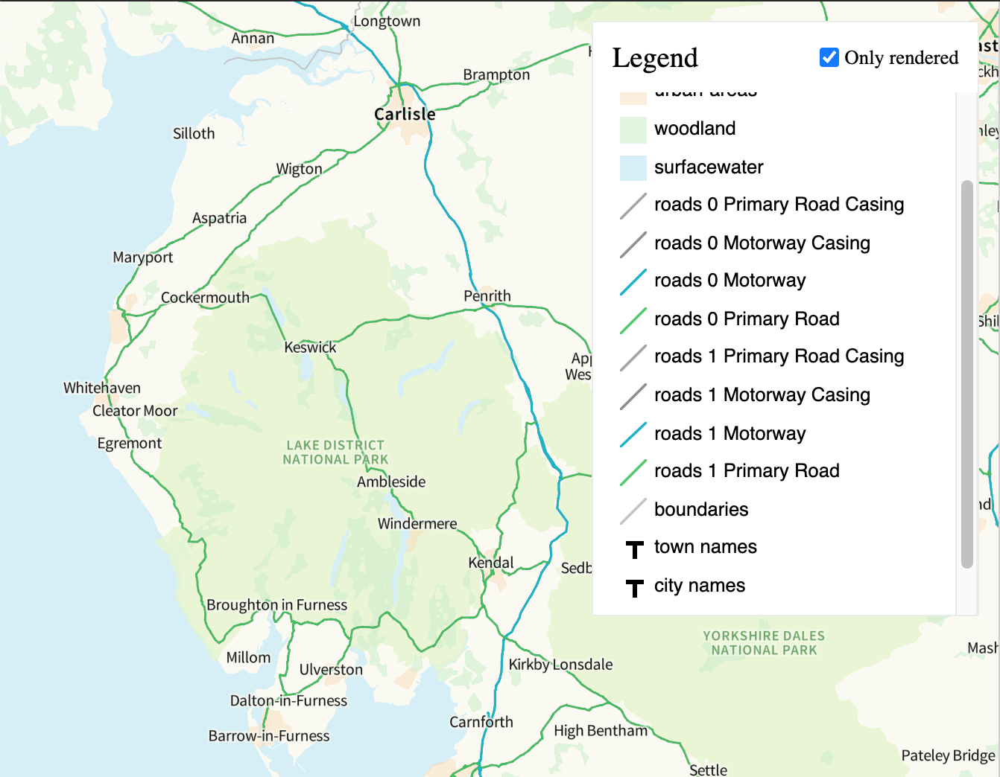

# legend-symbol
**Note:** This is a work in progress

An expressive map symbol (`<svg/>` icon) to represent a layer styled on a mapbox-gl-js map.

Supports the following layers types

 - `circle`
 - `fill`
 - `line`
 - `symbol` - as icon or text




## Usage
Here is an example using react. In the example below `map` is a instance of a mapbox-gl map and `layer` is the JSON representation of the layer you want to get a map symbol for.

```javascript
import LegendSymbol from '@mgljs-contrib/legend-symbol/react';

function Foo () {
  // Where `map` is a mapbox-gl map instance.
  const style = map.getStyle();
  const layer = style.layers[2];
  const sprite = style.sprite;

  return (
    <LegendSymbol
      sprite={sprite}
      zoom={zoom}
      layer={layer}
    />
  );
}
```
